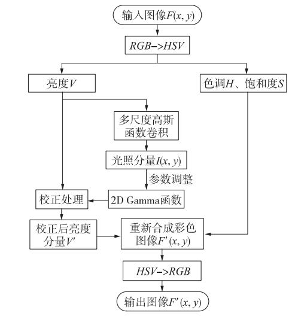

# Adaptive Gamma Correction
This repo provides a OpenCV based code of [paper][http://xueshu.baidu.com/usercenter/paper/show?paperid=8bf1076e6b97bf9dc16cf0a7c2e0cb1f&site=xueshu_se]
# 基于二维伽马函数的光照不均匀图像自适应校正算法

# 环境配置
OpenCV
Visual Studio

# 效果

